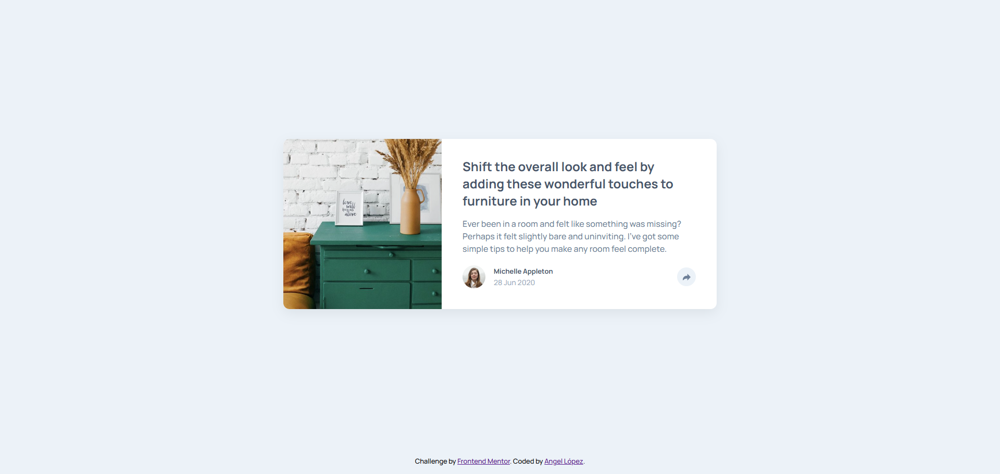

# 💬 Frontend Mentor - Solución del reto Testimonials grid section

Esta es mi solución al reto [Testimonials grid section](https://www.frontendmentor.io/challenges/testimonials-grid-section-Nnw6J7Un7).

## Tabla de contenidos

- [Resumen](#resumen)
  - [El reto](#el-reto)
  - [Captura de pantalla](#captura-de-pantalla)
  - [Enlaces](#enlaces)
- [Mi proceso](#mi-proceso)
  - [Construido con](#construido-con)
  - [Lo que aprendí](#lo-que-aprendí)
  - [Desarrollo continuo](#desarrollo-continuo)
  - [Recursos útiles](#recursos-útiles)
- [Autor](#autor)
- [Agradecimientos](#agradecimientos)

## 💻 Resumen

### El reto

Los usuarios deberían poder:

- Ver la disposición óptima del diseño del sitio según el tamaño de pantalla del dispositivo.
- Ver los botones de compartir de redes sociales cuando den clic en el botón de compartir.

### Captura de pantalla

### Enlaces

- URL de la solución: https://github.com/angeldavid04/article-preview-component
- URL del sitio en vivo: https://angeldavid04.github.io/article-preview-component

## 💪 Mi proceso

### Construido con

- HTML5 semántico
- Propiedades personalizadas de CSS
- Grid
- Flexbox

### Lo que aprendí

Repasé mis conocimientos en HTML, CSS y JavaScript, en especial este ultimo al aplicar manipulación del DOM.

Aprendí la manera correcta de mostrar y ocultar elementos con JS de forma accesible, utilizando el atributo aria-expanded.

También aprendí el uso de propiedades CSS útiles para hacer un menu desplegable, como son visibility y opacity.

### Desarrollo continuo

Me gustaría seguir aprendiendo a maquetar diseños interactivos que son accesibles y usables.

### Recursos útiles

- [MDN Web Docs](https://developer.mozilla.org/es/) - Este recurso es muy bueno y me ayuda sobre todo a escoger funciones y características que funcionan en cualquier navegador.
- [W3Schools](https://www.w3schools.com/cssref/pr_gen_quotes.php) - Este recurso me ayuda a entender las propiedades CSS cuando tengo dudas.
- [CSS Scan - CSS box shadow examples](https://getcssscan.com/css-box-shadow-examples) - Este recurso me ayuda a escoger sombras para elementos.

## 🤓 Autor

- Frontend Mentor - [Angel López](https://www.frontendmentor.io/profile/AngelDavid-dev)

## ♥️ Agradecimientos

Le quiero dar un agradecimiento a mi maestros del bachillerato porque sin ellos no fuera quien soy ahora, JonMircha por ser un gran docente digital y enseñarme los fundamentos del desarrollo web, y a Lucas Dalto por ofrecerme muy buenos cursos para aprender y repasar.
